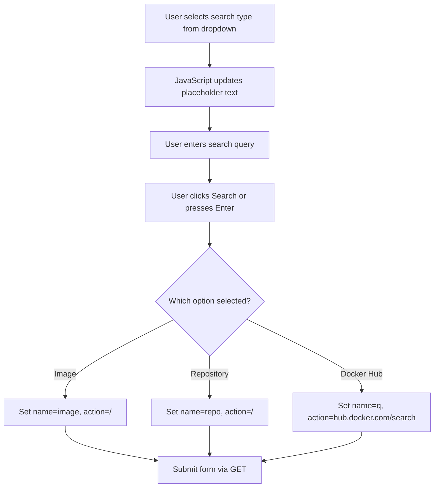

# Goal  Simpify Search Boxes from 3 to 1

Problem:

[Search in explorders template.go](/internal/explore/templates.go) is a confusing mess on the app mainpage as seen in this screenshot:


There are three search input boxes, but only one can be used at any give time. 

## Proposed Solution:

### Selection Dropdown or Radio

Create a Single Text Input, 3 routes:
    1. Image
        Requests to `/?image=namespace/repo:tag`
    2. Repo
        Requests to `/?repo=repo`
    3. Docker Hub
        POSTs to `https://hub.docker.com/search?q=`
    ~~4. (TODO: Cache History Search)~~
        ~~1. Search the sqlite database for previously observed file names~~

#### Considerations:

- Must still allow DIRECT posts and gets to continue to work 
- example text will need to be refactored to provider hovertext help or to render it when the option is selected

- Default to optionn 1, the Image route (currently the top most text input in the screenshot)
    - `<input size="100" type="text" name="image" value="ubuntu:latest">`


---


Based on my analysis, here's the proposed design for the unified search form:

## Current State Analysis

The [`landingPage`](internal/explore/templates.go:22) constant contains 3 separate `<form>` elements:

| Form | Action | Method | Input Name | Default Value |
|------|--------|--------|------------|---------------|
| Image | `/` | GET | `image` | `ubuntu:latest` |
| Repo | `/` | GET | `repo` | `ubuntu` |
| Docker Hub | `https://hub.docker.com/search` | GET | `q` | (empty) |

## Proposed Design

### HTML Structure

```
+------------------+  +----------------------------------+  +--------+
| [Dropdown v]     |  | [Search Input Text Field]        |  | Search |
+------------------+  +----------------------------------+  +--------+
     ^                      ^
     |                      |
  Options:               Dynamic placeholder
  - Image (default)      based on selection
  - Repository
  - Docker Hub
```

### Key Design Decisions

1. **Single Form with JavaScript Handler** - The form will use JavaScript to:
   - Dynamically set the form action URL
   - Dynamically set the input field's `name` attribute
   - Update placeholder text when dropdown changes

2. **Dropdown Options**:
   - `image` - "Image" (default) - placeholder: `ubuntu:latest`
   - `repo` - "Repository" - placeholder: `ubuntu`
   - `dockerhub` - "Docker Hub" - placeholder: `Search Docker Hub...`

3. **Form Submission Logic**:
   - For `image`: Submit to `/?image={value}`
   - For `repo`: Submit to `/?repo={value}`
   - For `dockerhub`: Submit to `https://hub.docker.com/search?q={value}`

4. **Backward Compatibility**: Direct URL access to `/?image=...` and `/?repo=...` will continue to work since the server-side handlers remain unchanged.

### Implementation Flow

