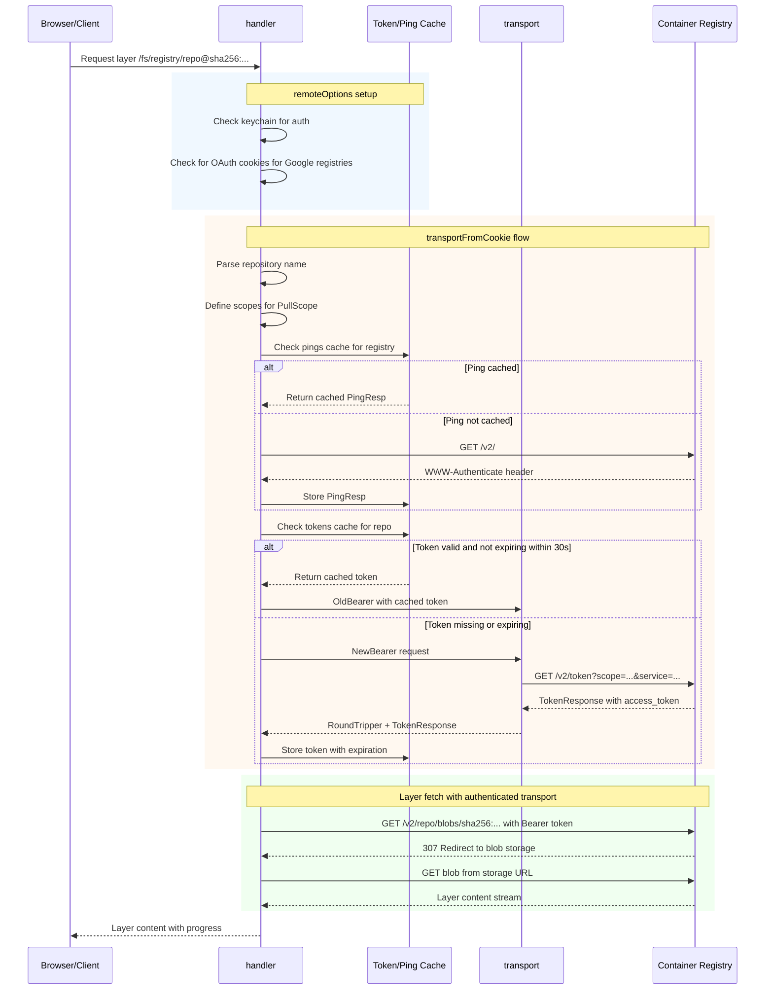
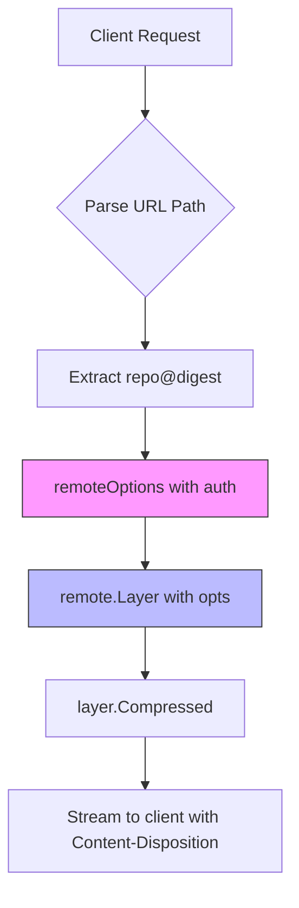

# Registry Authentication Flow for Layer Downloads

## Overview

This document describes how registry authentication works in the yolosint codebase when downloading layers that require authentication. Unlike the `SaveURL` functionality (which provides a download link for individual files carved from within a layer), this covers downloading complete layers with proper authentication.

## Authentication Flow Diagram



## Key Components

### 1. Token Cache Structure

From [`explore.go`](internal/explore/explore.go:49):

```go
type token struct {
    Expires       time.Time
    TokenResponse *transport.TokenResponse
}
```

### 2. Handler State

The handler maintains several caches:

- `pings map[string]*transport.PingResp` - Registry domain to ping response
- `tokens map[string]token` - Repository to bearer token
- `redirects map[string]string` - Blob digest to final URL for Range requests

### 3. transportFromCookie Function

From [`cookies.go`](internal/explore/cookies.go:18):

This is the core function that handles authentication:

1. Parses the repository name
2. Sets up pull scopes
3. Creates a transport with retry and user-agent
4. Checks ping cache or performs new ping
5. Checks token cache - reuses if valid for 30+ seconds
6. Gets new bearer token via `transport.NewBearer` if needed
7. Caches the new token

### 4. remoteOptions Function

From [`registry.go`](internal/explore/registry.go:37):

Assembles all remote options including:
- Context
- Authentication from keychain
- OAuth tokens from cookies for Google registries
- Authenticated transport from `transportFromCookie`

## How to Download an Authenticated Layer

### Current Direct URL Approach - Does NOT Work for Private Registries

The current download links in the UI use direct registry URLs:

```go
downloadURL := fmt.Sprintf("https://%s/v2/%s/blobs/%s", registry, repoPath, digest)
```

This URL requires the browser to have its own authentication with the registry, which typically fails for private registries.

### Recommended Approach - Proxy Through Handler

To download a complete layer with authentication, you should use the existing [`fetchBlob`](internal/explore/registry.go:197) pattern:



### Implementation Pattern

To add authenticated layer download, create a handler that:

1. **Route**: Add a new route like `/download/` or modify existing `/fs/` with a query param
2. **Authentication**: Use `remoteOptions` to get authenticated transport
3. **Fetch**: Use `remote.Layer` to get the layer with auth
4. **Stream**: Return `layer.Compressed()` with appropriate headers

Example flow based on existing [`fetchBlob`](internal/explore/registry.go:197) code:

```go
func (h *handler) downloadLayer(w http.ResponseWriter, r *http.Request) error {
    // Parse reference from URL
    ref := // extract from URL path
    
    blobRef, err := name.NewDigest(ref)
    if err != nil {
        return err
    }

    // Get authenticated remote options
    opts := h.remoteOptions(w, r, blobRef.Context().Name())
    
    // Fetch layer with authentication
    l, err := remote.Layer(blobRef, opts...)
    if err != nil {
        return err
    }

    // Get compressed content
    rc, err := l.Compressed()
    if err != nil {
        return err
    }
    defer rc.Close()

    // Set download headers
    w.Header().Set("Content-Disposition", fmt.Sprintf(`attachment; filename="%s.tar.gz"`, blobRef.DigestStr()))
    w.Header().Set("Content-Type", "application/gzip")
    
    // Stream layer to client
    _, err = io.Copy(w, rc)
    return err
}
```

## Difference from SaveURL

| Aspect | SaveURL | Layer Download |
|--------|---------|----------------|
| **What it downloads** | Single file from within a layer | Entire layer blob |
| **URL Pattern** | `/fs/repo@digest/path/to/file?dl=1` | `/download/repo@digest` or direct registry URL |
| **Processing** | Extracts file from tar.gz stream | Streams compressed layer as-is |
| **Current Auth** | Proxied through handler with auth | Direct URL - no auth |

## Summary

The authentication flow follows this pattern:

1. **Ping**: Check/cache registry capabilities via `GET /v2/`
2. **Token**: Exchange credentials for bearer token via token endpoint
3. **Request**: Include bearer token in Authorization header
4. **Cache**: Reuse tokens until they expire - 30 second buffer

For downloading authenticated layers, the solution is to proxy the request through the handler rather than providing a direct registry URL, using the existing `remoteOptions` and `remote.Layer` patterns already in the codebase.

## Implementation Plan

### Step 1: Add Route Handler

In [`explore.go`](internal/explore/explore.go:119), add a new route:

```go
mux.HandleFunc("/download/", h.errHandler(h.downloadLayer))
```

### Step 2: Implement downloadLayer Function

Add to [`registry.go`](internal/explore/registry.go) after the existing `fetchBlob` function:

```go
func (h *handler) downloadLayer(w http.ResponseWriter, r *http.Request) error {
    // Strip /download/ prefix
    path := strings.TrimPrefix(r.URL.Path, "/download/")
    
    // Parse repo@digest format
    blobRef, err := name.NewDigest(path)
    if err != nil {
        return fmt.Errorf("invalid reference %q: %w", path, err)
    }

    // Get authenticated remote options
    opts := h.remoteOptions(w, r, blobRef.Context().Name())
    
    // Fetch layer with authentication
    l, err := remote.Layer(blobRef, opts...)
    if err != nil {
        return fmt.Errorf("fetching layer: %w", err)
    }

    // Get layer size for Content-Length
    size, err := l.Size()
    if err != nil {
        log.Printf("could not get layer size: %v", err)
    }

    // Get compressed content
    rc, err := l.Compressed()
    if err != nil {
        return fmt.Errorf("getting compressed layer: %w", err)
    }
    defer rc.Close()

    // Set download headers
    digest := blobRef.DigestStr()
    filename := fmt.Sprintf("%s.tar.gz", strings.ReplaceAll(digest, ":", "-"))
    w.Header().Set("Content-Disposition", fmt.Sprintf(`attachment; filename=%q`, filename))
    w.Header().Set("Content-Type", "application/gzip")
    if size > 0 {
        w.Header().Set("Content-Length", strconv.FormatInt(size, 10))
    }
    
    // Stream layer to client
    _, err = io.Copy(w, rc)
    return err
}
```

### Step 3: Update Download Links in render.go

In [`render.go`](internal/explore/render.go:435), change from direct registry URL to proxied URL:

**Before:**
```go
downloadURL := fmt.Sprintf("https://%s/v2/%s/blobs/%s", registry, repoPath, digest)
```

**After:**
```go
downloadURL := fmt.Sprintf("/download/%s@%s", w.repo, digest)
```

### Step 4: Files to Modify

| File | Change |
|------|--------|
| [`internal/explore/explore.go`](internal/explore/explore.go) | Add route handler registration |
| [`internal/explore/registry.go`](internal/explore/registry.go) | Add `downloadLayer` function |
| [`internal/explore/render.go`](internal/explore/render.go) | Update download URL generation |

### Step 5: Testing

1. Start the server locally
2. Navigate to a manifest with layers
3. Click the download link for a layer
4. Verify the file downloads with correct filename
5. Test with a private registry that requires authentication
